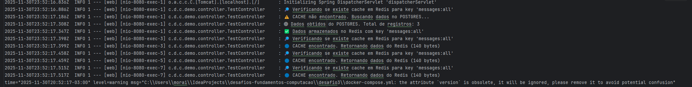

# Desafio 3 — Aplicação Spring Boot com PostgreSQL e Redis

## 1. Descrição da Solução

Esta aplicação é um microserviço Spring Boot que demonstra integração com **PostgreSQL** como banco de dados relacional e **Redis** como cache. O objetivo é ilustrar a persistência de dados, o cacheamento e testar requisições repetidas para verificar o uso do cache.

### Decisões Técnicas

- **Spring Boot 4.x** — Framework principal para o microserviço
- **PostgreSQL 15** — Banco relacional para persistência de mensagens
- **Redis 7** — Cache para acelerar respostas e reduzir carga no banco
- **Docker + Docker Compose** — Orquestração de containers para fácil setup e testes
- **Gradle 8.14** — Build do projeto Java
- **SLF4J + Logback** — Logging para monitoramento das operações e do cache

### Containers e Rede

- `spring-app`: microserviço Spring Boot
- `postgres-db`: banco PostgreSQL
- `redis-cache`: cache Redis

Todos os containers se comunicam via rede interna Docker chamada **backend**.

## 2. Como Executar

### Passo 1 — Rodar o script de teste

No terminal, execute:

```bash
bash ./run-teste.sh
```
O script irá:

- Subir os containers (spring-app, postgres-db, redis-cache)
- Executar 3 requisições para /v1/message:
  - Primeira execução: consulta o PostgreSQL
  - Segunda e terceira execução: responde via Redis (cache)
- Salvar todos os logs em logs.txt
- Reiniciar os containers e repetir o teste, comprovando que o cache foi limpo

LOGS DA APLICAÇÃO: 



### Passo 2 — Consultar logs

Todos os logs ficam registrados em:

- logs.txt

Para acompanhar em tempo real:

```bash
docker logs -f spring-app
```

## 3. Observações

O script possui verificações automáticas para aguardar o Spring Boot subir antes das requisições.

O Redis garante que respostas subsequentes sejam muito mais rápidas e que consultas redundantes ao banco sejam evitadas.