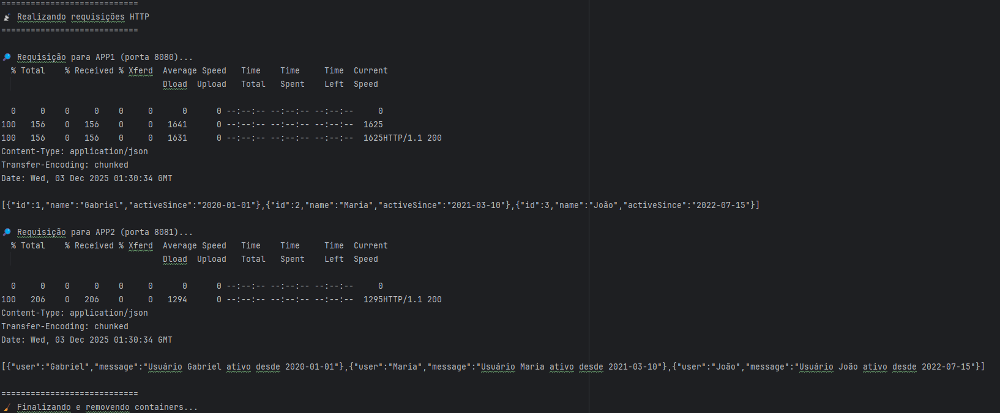

# Desafio 4 — Microsserviços Independentes (README)

## Visão geral
Este repositório contém dois microsserviços **independentes** desenvolvidos em **Spring Boot (Java)** que se comunicam via HTTP. A arquitetura é propositalmente simples para demonstrar comunicação entre serviços sem gateway.

- **app1 (UserService)** — retorna uma lista estática de usuários em JSON.
- **app2 (ConsumerService)** — consome o `UserService` e expõe mensagens combinadas (ex.: “Usuário X ativo desde ...”).

Ambos rodam em containers Docker e estão orquestrados pelo `docker-compose`. Também há um script `run.sh` que sobe os serviços, realiza requisições de teste e gera um `log.txt`. Ao final o script derruba os containers.


---

## Arquitetura e decisões técnicas

### Tecnologias

- Java 17/21 (dependendo do Dockerfile base)
- Spring Boot 
- Spring Cloud OpenFeign (no ConsumerService) para comunicação HTTP entre serviços 
- Docker / docker-compose 
- Bash (script run.sh) para automação de build, run e testes básicos

### Decisões técnicas

- Feign Client em ConsumerService — escolha por simplicidade, legibilidade e integração com Spring Cloud.
- Usuários estáticos no UserService — elimina necessidade de banco para o desafio.
- Rede Docker Compose — comunicação entre containers usando nome de serviço/container (ex.: spring-app1) para chamadas internas.
- Exposição padrão de porta interna 8080 — ambos os apps escutam em 8080 dentro dos containers; portas mapeadas diferente no host para evitar conflito. 
- Script de teste (run.sh) — automatiza build, subida, requisições e teardown, além de produzir log.txt com os resultados.

---

# Estrutura do repositório
```
/  
├─ app1/  
├─ app2/  
├─ docker-compose.yml  
├─ run.sh  
└─ README.md
```

---

# Networking entre containers
Comunicação via nome dos serviços:
```
http://spring-app1:8080/v1/users
```

---

# Endpoints disponíveis

Supondo docker-compose com mapeamentos:

- app1 externamente em localhost:8080 (container interno 8080)
- app2 externamente em localhost:8081 (container interno 8080)


## app1 — UserService

- GET /v1/users - Retorna lista de usuários (JSON estático).

Exemplo de resposta

```json
[
  { "id": 1, "name": "Gabriel", "activeSince": "2020-01-01" },
  { "id": 2, "name": "Maria",   "activeSince": "2021-03-10" },
  { "id": 3, "name": "João",    "activeSince": "2022-07-15" }
]
```

### app2 — ConsumerService

- GET /v1/message - Chama o UserService (internamente via Feign/HTTP) e retorna uma lista de objetos que combinam nome + mensagem.

Exemplo de resposta

```json
[
  { "order": "Gabriel", "message": "Usuário Gabriel ativo desde 2020-01-01" },
  { "order": "Maria",   "message": "Usuário Maria ativo desde 2021-03-10" },
  { "order": "João",    "message": "Usuário João ativo desde 2022-07-15" }
]
```

---

# run.sh — o que faz e como usar

O que o run.sh automatiza

1. Faz docker-compose up -d --build para construir e subir containers em background. 
2. Aguarda um tempo (sleep) para os serviços subirem. 
3. Executa requisições HTTP de teste para os endpoints externos:
- http://localhost:8080/v1/users (app1)

- http://localhost:8081/v1/message (app2)

4. Registra status code / headers / corpo das respostas em log.txt. 
5. Executa docker-compose down -v para parar e remover containers, network e volumes anônimos. 
6. Apresenta um resumo final e local do log.txt.


### Como usar o run.sh

1. Dê permissão de execução:
```bash
chmod +x run.sh
```
2. Execute:
```bash
./run.sh
```
3. Após a execução, confira log.txt com todo o output (build, responses, teardown).
---

# Debug e notas comuns

- 404 Not Found:
  - Verifique se você está chamando o endpoint correto (/v1/users em app1; /v1/message em app2). 
  - Verifique se as portas mapeadas no host estão corretas (compose) e se a aplicação no container realmente escuta em 8080 (ver Dockerfile EXPOSE e configurações do Spring Boot).

- Conexão entre containers:
  - Dentro da network Docker, use http://<service_name>:<container_port>/... (ex.: http://spring-app1:8080/v1/users) — não use localhost.

- Tempo de boot:
  - Spring Boot pode demorar alguns segundos para ficar "pronto". O run.sh usa sleep 10 por simplicidade; para produção usar healthchecks ou waiting loops é melhor.

- Logs dos containers:
  - docker-compose logs -f app1 / docker-compose logs -f app2

# Limitações e melhorias possíveis

- Atualmente não há health-checks automáticos; o run.sh assume sleep 10.

- Poderia adicionar retries e backoff no script ao invés de sleep fixo.

- Em produção, considere usar um service discovery/gateway e TLS.

- Adicionar testes automatizados e CI (GitHub Actions).

# Conclusão

Este projeto demonstra comunicação HTTP simples entre dois microsserviços Spring Boot usando Feign e Docker. O run.sh facilita testes locais e gera log.txt com as requisições.
Se desejar, eu posso:

- Adicionar health-checks no run.sh com tentativas/retries;

- Gerar docker-compose.override.yml para desenvolvimento;

- Incluir scripts para rodar apenas um dos serviços;

- Mostrar como configurar Feign para usar nomes do serviço do compose (ex.: com @FeignClient(name="order-service", url="http://spring-app1:8080")).